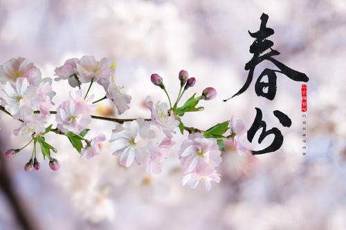
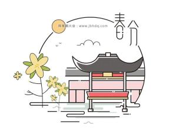

### 春分

春分， 太阳直射点在赤道上，此后太阳直射点继续北移，故春分也称“升分”。古时又称为“日中”、“日夜分”、“仲春之月”。春分是个比较重要的节气，它不仅有天文学上的意义：南北半球昼夜平分，在气候上，也有比较明显的特征。春分时，从理论上说，全球昼夜等长(参见晨昏蒙影)。春分之后，北半球各地昼渐长夜渐短，南半球各地夜渐长昼渐短。春分时，全球无极昼极夜现象。春分之后，北极附近开始极昼，范围渐大；南极附近极昼结束，极夜开始，范围渐大。春分一到，气候温和，雨水充沛，阳光明媚，中国大部分地区的越冬作物进入春季生长阶段，此时也是早稻的播种期。
在春分那一天，有“竖蛋”的民间习俗。世界各地都会有数以千万计的人在做“竖蛋”试验。这一被称之为“中国习俗”的玩艺儿，何以成为“世界游戏”，仍尚难考证。不过其玩法简单易行且富有趣味：选择一个光滑匀称、刚生下四五天的新鲜鸡蛋，轻手轻脚地在桌子上把它竖起来。虽然失败者颇多，但成功者也不少。春分成了竖蛋游戏的最佳时光，故有“春分到，蛋儿俏”的说法。竖立起来的蛋儿好不风光。在中国岭南一带，有一个习俗，叫做“春分吃春菜”。“春菜”是一种野苋菜，又称之为“春碧蒿”。

