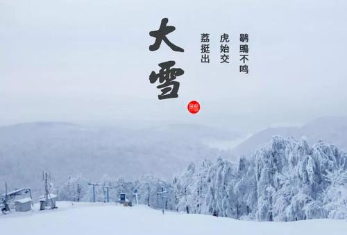
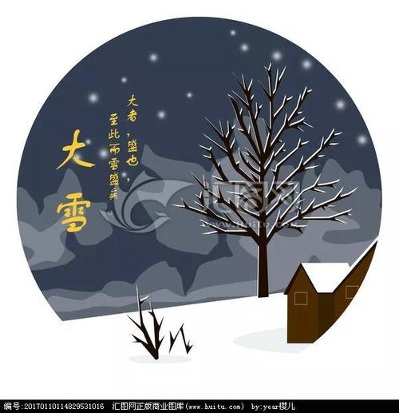

### 大雪

大雪，因天寒地冻、 大雪纷飞而名 。“瑞雪兆丰年。”“麦盖三床被（ 大雪）， 头枕蒸馍睡。” 农事活动继续以 水利建设、 整修道路水渠为主， 并开始磨粉， 生产粉条、粉皮， 从事商业经营及商品 生产等活动。 农谚有“场光地净， 五沟挖通”， “薄地想丰收， 冬闲挖深沟”。 大雪忌无雪， 俗谚有“大雪不见雪， 来年不收麦”， “今年大雪把门 封， 来年一定好收成”， “雪水化成河， 麦收不会薄”，“大雪丰收来， 无雪少吃麦” 之说。大雪时节，天寒地冻。 留给人们印象最深的，莫过于“寒号鸟”的传说。

