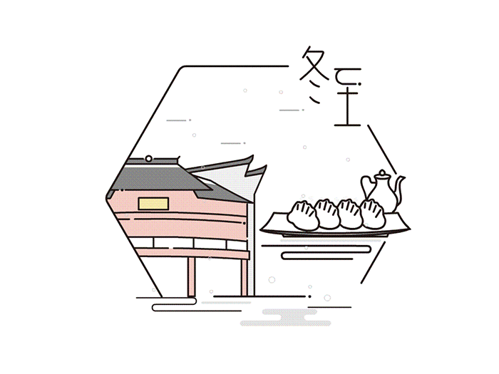

### 冬至

冬至，太阳直射南回 归线， 是日交九， 此后天气渐入严寒。有《 冬九九歌》：“ 一九二九闭 门 塞手， 三九四 九冻死鸡狗， 五九六九沿河看柳， 七九河开，八九燕来，九九加一九， 耕牛遍地走。” 农业生产上， 除继续进行防冻、积肥等工作外，还要注意人畜的安全过冬。“吃了冬至饭（姜饭）， 一天长一线”， 白 天将逐渐变长。 冬至忌无雨， 俗谚云：“立冬无雨看冬至， 冬至无雪一冬晴。” 
冬至兼具自然与人文两大内涵，既是自然节气点，也是一个传统的祭祖节日。冬至是四时八节之一，中华民族自古以来就有在冬至祭祀祖先的传统，以示孝敬、不忘本。因各地礼俗的不同，祭祖形式也各异。祭祖的同时，有的地方也祭祀天地神灵，供品主要有三牲饭菜、三茶五酒等。冬至被视为冬季的大节日。在民间广泛流传着“冬至大如年”的讲法，冬至又被称为“亚岁”、“小年”，一是说明年关将近，二是表示冬至的重要性。

