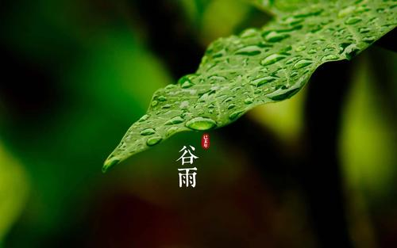
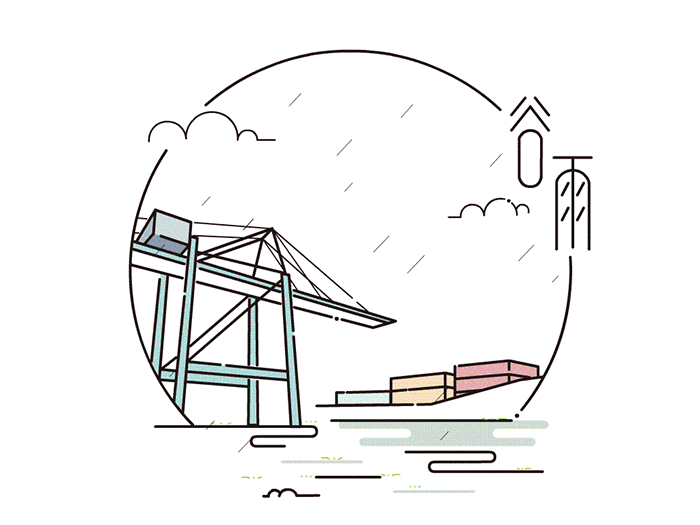

### 谷雨

谷雨为公历每年四月 二十日 前后，太阳到达黄经30° 时开始。 一般天气变暖， 断霜雪， 雨量也较前增多， 是播种的重要季节， 开始种高粱、 玉米等秋作物，有“谷雨下秧， 立夏栽”， “谷雨麦怀胎” 之说。 此外，谷雨无雨， 亦为 荒年之兆， 民 间 忌之， 有“ 明 清明，暗谷雨”， “清明 要明， 谷雨要雨” 之俗谚， 也有“谷雨到， 布谷叫， 前三天叫 受干， 后三天叫 受淹” 的说法。 雨后开始碾场， “三月 不碾场， 打麦土里扬”。

