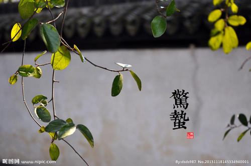
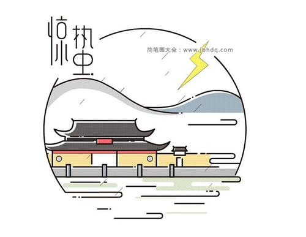

### 惊蛰

惊蛰象征气温上升， 天气变暖， 地下蛰伏的各种动物开始苏醒、 蠕动。 有“雨水早，春分迟 惊蛰育苗正适时”， “惊蛰不过不下种” 之农谚。是日，闻雷兆年景丰收，风调雨顺，五谷丰登。民间 有“雷打惊蛰谷米贱”， “惊蛰闻雷米如泥”， “过了 惊蛰节，耕地莫停歇”，“雷打惊蛰前，高岗 能种田”，“雷打惊蛰后，河湾能种豆”， “惊蛰打雷， 小满发水”， “惊蛰云不动，寒到 五月 中 ”， “ 惊蛰不放蜂， 十笼九笼空 ” 的俗语。

