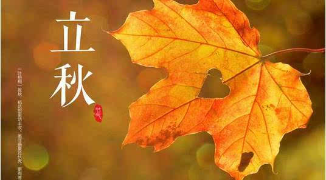
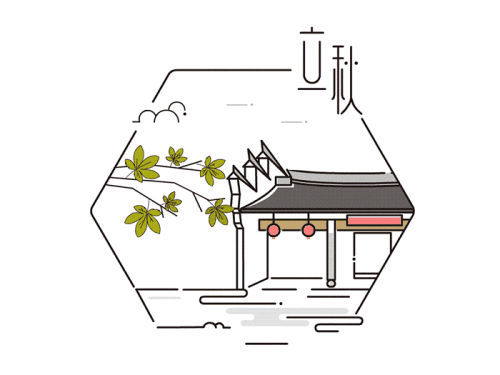

### 立秋

立秋，秋季开 始， 时在三伏之中。 有“ 三 伏 不 到， 秋来到” 之说，但天气仍然炎热难耐， 有“秋老虎” 之说。 农事有“立了秋， 挂锄钩” 之说，意为庄稼不再锄了； 还有“立罢秋， 万事休”， “立秋种芝麻， 老死不开花”， 意为此时各种作物不能再种了。但此时要播撒葱子，育出 小葱苗，待第二年春天移栽。 还可种菠菜、 青菜、 芫荽。 立秋是当地农家的大节气， 是庄稼接近成熟的季节。“立秋三天遍地红”， 指高粱穗变红成熟。 立秋日 忌雷、 雨、 风， 有“雷打秋， 晚禾折半收”， “秋前北风， 秋后雨， 秋后北风干到底” 的俗谚。

