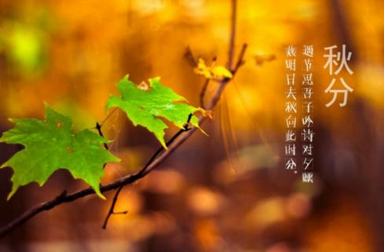
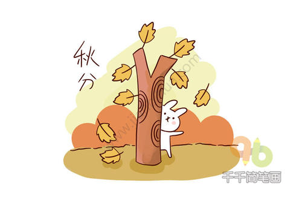

### 秋分

秋分，秋季的一半， 此后， 北半球渐短， 夜渐长。 秋分后， 既要抓紧送粪犁地， 积极备播小麦， 又夹带收秋，是秋季最忙时期。 农谚有“白 露早， 寒露迟， 秋风种麦正适时”， “秋分分断根”， “秋分过五， 小麦入土”，“ 秋 天 弯 弯 腰， 强 似 春 天 转 一 遭 儿”， “ 初 一 不 下 盼十三， 十三不下一冬干”， “一年辛勤在于秋， 粮不入屋不算收”， “三春不如一秋忙， 收不到屋里不算粮”。 秋分前后， 月 亮落地的变化， 将直接预示着来年年景的好坏。 俗谚云：“ 七月 十五早看天， 强似抽签问 神仙；月 亮落地接云彩， 年景好的说不得； 月 亮落地光塌塌，明年粮食打不发。” 
在秋分时节，是传统的“祭月节”。我国自古就有“春祭日、秋祭月”之说。中秋节是上古天象崇拜——敬月习俗的遗痕。现代社会中秋节则是由传统的“祭月节”而来。据考证，最初“祭月节”是定在“秋分”这一天，不过由于这一天在农历八月里的日子每年不同，不一定都有圆月，后来就将“祭月节”由“秋分”调至农历八月十五日。祭月，在我国是一种十分古老的习俗，实际上是古人对“月神”的一种崇拜活动。古时在广东部分地区，人们有着在中秋晚上拜祭月的习俗。夕月，即祭拜月神。设大香案，摆上月饼、西瓜、苹果、红枣、李子、葡萄等祭品。在月下，将“月神”牌位放在月亮的那个方向，红烛高燃，全家人依次拜祭月亮，祈求福佑。

