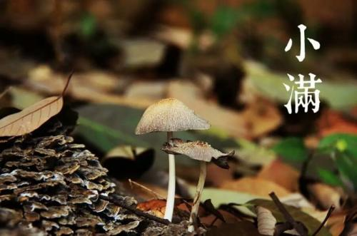
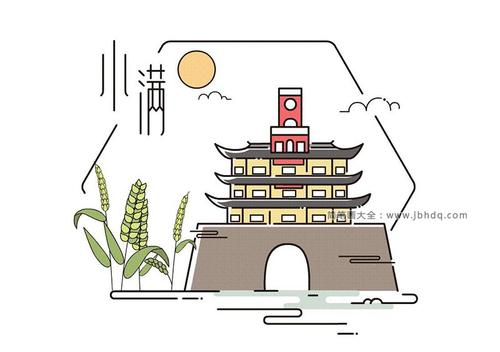

### 小满

小满，农民购置农器家具， 做收麦前的准备工作， 并开始套种晚秋作物。 有“小满不满， 芒种不忙”，“小满十八天， 不熟也要干（ 指小麦）”， “小满种谷， 憋满仓屋” 的农谚。
在小满这一天，有“抢水”与“祭车神”的习俗。旧时水车车水排灌为农村大事。谚云：“小满动三车（三车指的是丝车、油车、水车）。”水车于小满时启动。此前，农户以村圩为单位举行“抢水”仪式。“祭车神”亦为农村古俗，传说“车神”为白龙，农家在车水前，于车基上置鱼肉、香烛等祭拜之物，特殊之处为祭品中有白水一杯，祭时泼入田中，有祝水源涌旺之意。这些习俗表明了农民对水利排灌的重视。

