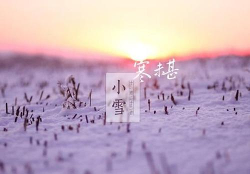
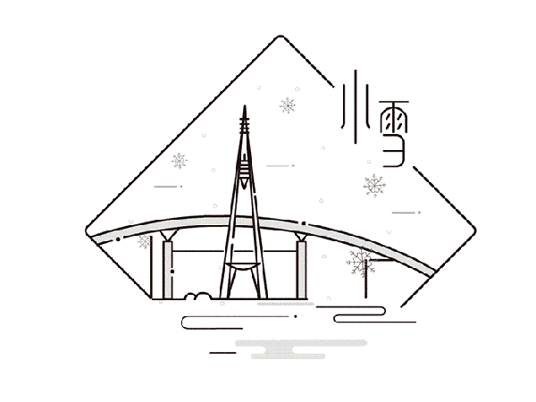

### 小雪

小雪“，气温下降， 始飘雪花。 开始农田水利 基本建设，整修道路， 开展副业活动。农谚有“千家万户 ，沫子粪土”，“ 修渠 筑坝， 天旱不怕 ”， “ 修好水渠 筑好塘，年年丰收有保障”， “修好水利， 一本万利”。 
小雪到，吃糍粑”，是我国江南水乡的一种传统习俗。每年的这个时候，大人和孩子们都会放在嘴上唠叨着：几号了，还有几天就要到小雪了，谁家的糯米碾好了，谁家的还在场上晒着呢。这时候小孩子们都很兴奋，觉得就象过年似的。

