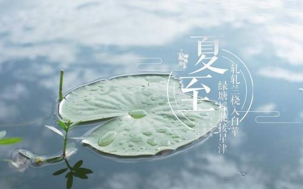
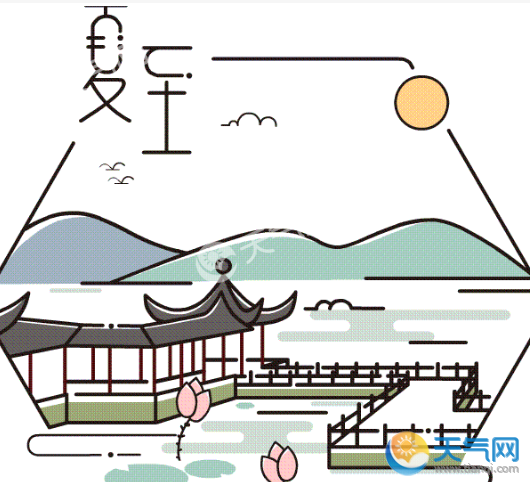

### 夏至

夏至是农事很重要的节气，气温升高， 天气变热，忌连阴 雨，有“荒谷烂麦长玉茭” 之说。“春争日 ， 夏争时， 中 耕锄草不宜迟”。夏至三庚入伏， 伏有三十天或四十天， 分头伏、 中 伏和末伏。 每伏十天， 中伏有二十天的。夏至是太阳在天空位置最高的一天，在民间有“夏至一阴生”的说法。其实严格来讲，“节气”反映的是季节、物候、气候变化规律，而“阴阳五行”即属于“干支”范畴，“阴阳”的消长，是以“干支”为推算依据。夏至在中夏之位，即午位，午属阳，夏至这天阳盛无疑，但不一定是午月之中阳气最盛的一天，具体哪天阳气最盛依据干支推算。夏至这天，太阳直射地面的位置到达一年的最北端，几乎直射北回归线（北纬23°26'），北半球的白昼达到最长，且越往北昼越长。夏至这天虽然白昼最长，太阳角度最高，但并不是一年中天气最热的时候。因为，接近地表的热量，这时还在继续积蓄，并没有达到最多的时候。

